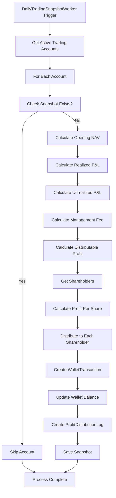

# Daily Profit Distribution System - Technical Documentation

## 📋 Tổng quan

Hệ thống chi lãi hàng ngày (Daily Profit Distribution) là chức năng core để tự động tính toán và phân phối lợi nhuận từ các Trading Account đến các cổ đông (shareholders) dựa trên số lượng cổ phần họ nắm giữ.

## 🏗️ Kiến trúc hệ thống

### Components chính

```
┌─────────────────────┐    ┌──────────────────────┐    ┌─────────────────────┐
│  DailySnapshot      │───▶│  ProfitDistribution  │───▶│  WalletTransaction  │
│  Worker             │    │  Service             │    │  Update             │
└─────────────────────┘    └──────────────────────┘    └─────────────────────┘
          │                           │                           │
          ▼                           ▼                           ▼
┌─────────────────────┐    ┌──────────────────────┐    ┌─────────────────────┐
│ TradingAccount      │    │ ProfitDistribution   │    │ Wallet Balance      │
│ Snapshot            │    │ Log                  │    │ Update              │
└─────────────────────┘    └──────────────────────┘    └─────────────────────┘
```

## 📊 Database Schema

### 1. TradingAccountSnapshot
```sql
CREATE TABLE TradingAccountSnapshots (
    SnapshotID BIGINT PRIMARY KEY IDENTITY,
    TradingAccountID INT NOT NULL,
    SnapshotDate DATE NOT NULL,
    OpeningNAV DECIMAL(18,2) NOT NULL,
    RealizedPAndLForTheDay DECIMAL(18,2) NOT NULL,
    UnrealizedPAndLForTheDay DECIMAL(18,2) NOT NULL,
    ManagementFeeDeducted DECIMAL(18,2) NOT NULL,
    ProfitDistributed DECIMAL(18,2) NOT NULL,
    ClosingNAV DECIMAL(18,2) NOT NULL,
    ClosingSharePrice DECIMAL(18,8) NOT NULL,
    CreatedAt DATETIME2 DEFAULT GETUTCDATE(),
    
    CONSTRAINT UQ_TradingAccountSnapshots_Account_Date 
        UNIQUE (TradingAccountID, SnapshotDate)
);
```

### 2. ProfitDistributionLog
```sql
CREATE TABLE ProfitDistributionLogs (
    DistributionLogID BIGINT PRIMARY KEY IDENTITY,
    TradingAccountSnapshotID BIGINT NOT NULL,
    TradingAccountID INT NOT NULL,
    UserID INT NOT NULL,
    DistributionDate DATE NOT NULL,
    SharesHeldAtDistribution BIGINT NOT NULL,
    ProfitPerShareDistributed DECIMAL(18,8) NOT NULL,
    TotalAmountDistributed DECIMAL(18,2) NOT NULL,
    WalletTransactionID BIGINT NULL,
    CreatedAt DATETIME2 DEFAULT GETUTCDATE(),
    
    FOREIGN KEY (TradingAccountSnapshotID) REFERENCES TradingAccountSnapshots(SnapshotID),
    FOREIGN KEY (TradingAccountID) REFERENCES TradingAccounts(TradingAccountID),
    FOREIGN KEY (UserID) REFERENCES Users(UserID),
    FOREIGN KEY (WalletTransactionID) REFERENCES WalletTransactions(TransactionID)
);
```

## ⚙️ Business Logic Flow

### 1. Automatic Daily Process (23:55 UTC)



### 2. Profit Distribution Calculation

```csharp
// 1. Management Fee Calculation
if (realizedPAndL > 0 && account.ManagementFeeRate > 0)
{
    managementFee = realizedPAndL * account.ManagementFeeRate;
}

// 2. Distributable Profit
distributableProfit = realizedPAndL - managementFee;

// 3. Profit Per Share
profitPerShare = distributableProfit / account.TotalSharesIssued;

// 4. Individual Distribution
foreach (shareholder in shareholders)
{
    amountToDistribute = profitPerShare * shareholder.Quantity;
    // Create wallet transaction and update balance
}
```

## 🔄 Current Implementation Status

### ✅ Đã hoàn thiện

1. **Automatic Worker**: `DailyTradingSnapshotWorker` chạy hàng ngày lúc 23:55 UTC
2. **Business Logic**: `ProfitDistributionService` với đầy đủ tính toán
3. **Data Models**: Complete database schema với audit trail
4. **Error Handling**: Duplicate prevention và comprehensive logging
5. **Transaction Integrity**: Sử dụng UnitOfWork pattern

### ⚠️ Chưa có (Manual Fallback)

1. **Admin Manual Trigger Endpoints**
2. **Snapshot Status Monitoring Dashboard**
3. **Manual Recalculation Capability**
4. **Admin UI for Manual Operations**

## 🎯 Manual Fallback Requirements

### API Endpoints cần bổ sung

#### 1. Manual Trigger Snapshot
```http
POST /api/v1/admin/trading-accounts/snapshots/trigger-manual
Authorization: Bearer <admin-token>
Content-Type: application/json

{
  "targetDate": "2024-01-15",
  "tradingAccountIds": [1, 2, 3], // null = all accounts
  "forceRecalculate": false
}

Response: {
  "success": true,
  "message": "Manual snapshot triggered successfully",
  "accountsProcessed": 3,
  "accountsSkipped": 0,
  "errors": []
}
```

#### 2. Get Snapshot Status
```http
GET /api/v1/admin/trading-accounts/snapshots/status?date=2024-01-15
Authorization: Bearer <admin-token>

Response: {
  "date": "2024-01-15",
  "accounts": [
    {
      "tradingAccountId": 1,
      "accountName": "Growth Fund Alpha",
      "snapshotExists": true,
      "snapshotId": 12345,
      "profitDistributed": 1250.50,
      "shareholdersCount": 25,
      "createdAt": "2024-01-16T00:05:00Z",
      "status": "Completed"
    },
    {
      "tradingAccountId": 2,
      "accountName": "Stable Income Fund",
      "snapshotExists": false,
      "status": "Pending",
      "reason": "No realized P&L for the day"
    }
  ]
}
```

#### 3. Recalculate Profit Distribution
```http
POST /api/v1/admin/trading-accounts/{accountId}/snapshots/{date}/recalculate
Authorization: Bearer <admin-token>
Content-Type: application/json

{
  "reason": "Correction due to data adjustment",
  "reverseExisting": true
}

Response: {
  "success": true,
  "oldDistribution": {
    "totalDistributed": 1250.50,
    "shareholdersCount": 25
  },
  "newDistribution": {
    "totalDistributed": 1180.75,
    "shareholdersCount": 25
  },
  "adjustmentAmount": -69.75
}
```

#### 4. Get Distribution History
```http
GET /api/v1/admin/trading-accounts/{accountId}/profit-distributions
Authorization: Bearer <admin-token>
Query Parameters:
- fromDate: date
- toDate: date  
- pageNumber: int
- pageSize: int

Response: PaginatedList<ProfitDistributionLogDto>
```

### UI Requirements

#### 1. Admin Dashboard - Snapshot Status Widget
```
┌─────────────────────────────────────────────┐
│ Daily Snapshot Status                       │
├─────────────────────────────────────────────┤
│ Date: [2024-01-15] [Today] [Custom]        │
│                                             │
│ ✅ Growth Fund Alpha     - $1,250.50       │
│ ✅ Stable Income Fund   - $890.25          │
│ ⚠️  Tech Innovation     - Pending          │
│ ❌ Global Equity        - Failed           │
│                                             │
│ [Trigger Manual Snapshot] [View Details]   │
└─────────────────────────────────────────────┘
```

#### 2. Manual Snapshot Trigger Modal
```
┌─────────────────────────────────────────────┐
│ Manual Snapshot Trigger                     │
├─────────────────────────────────────────────┤
│ Target Date: [2024-01-15] 📅                │
│                                             │
│ Trading Accounts:                           │
│ ☑️ All Active Accounts                      │
│ ☐ Selected Accounts:                        │
│   ☐ Growth Fund Alpha                       │
│   ☐ Stable Income Fund                      │
│   ☐ Tech Innovation Fund                    │
│                                             │
│ Options:                                    │
│ ☐ Force Recalculate (if exists)           │
│ ☐ Skip validation checks                    │
│                                             │
│ [Cancel] [Trigger Snapshot]                 │
└─────────────────────────────────────────────┘
```

#### 3. Profit Distribution Detail View
```
┌─────────────────────────────────────────────┐
│ Profit Distribution Details                 │
│ Growth Fund Alpha - 2024-01-15             │
├─────────────────────────────────────────────┤
│ Snapshot Information:                       │
│ • Opening NAV: $98,750.00                  │
│ • Realized P&L: $2,150.00                  │
│ • Management Fee: $32.25 (1.5%)           │
│ • Distributable Profit: $2,117.75         │
│                                             │
│ Distribution Summary:                       │
│ • Total Shares: 100,000                    │
│ • Profit Per Share: $0.02118               │
│ • Shareholders: 25 users                   │
│ • Total Distributed: $2,117.75            │
│                                             │
│ [Recalculate] [Export Report] [View Log]   │
└─────────────────────────────────────────────┘
```

## 🚨 Error Scenarios & Handling

### 1. Duplicate Prevention
- Database constraint: `UQ_TradingAccountSnapshots_Account_Date`
- Application check before processing
- Clear error messages in logs

### 2. Calculation Errors
- Validate total shares issued > 0
- Check for shareholders existence
- Handle floating point precision

### 3. Wallet Update Failures
- Transaction rollback on error
- Detailed error logging
- Admin notification system

## 📈 Monitoring & Alerts

### Key Metrics to Track
1. **Daily Success Rate**: % accounts processed successfully
2. **Distribution Amounts**: Total profit distributed per day
3. **Processing Time**: Time taken for complete process
4. **Error Rate**: Failed distributions per day

### Proposed Alerts
- ⚠️ Snapshot failed for any account
- ⚠️ Distribution amount differs significantly from average
- ❌ Worker failed to start/complete
- 📊 Weekly/Monthly distribution summary

## 🔐 Security Considerations

### Access Control
- Manual endpoints require `Admin` role
- Audit log for all manual operations
- Rate limiting on manual triggers

### Data Integrity
- All operations within database transactions
- Immutable audit trail in `ProfitDistributionLog`
- Backup verification before recalculation

## 📝 Testing Strategy

### Unit Tests
- `ProfitDistributionService` logic
- Edge cases (zero profit, no shareholders)
- Calculation precision tests

### Integration Tests
- End-to-end snapshot process
- Manual trigger workflows
- Error scenario handling

### Performance Tests
- Large number of shareholders
- Multiple accounts processing
- Concurrent manual operations

## 🚀 Deployment Notes

### Configuration
```json
{
  "DailySnapshot": {
    "ScheduleTime": "23:55:00",
    "TimeZone": "UTC",
    "RetryAttempts": 3,
    "RetryDelayMinutes": 5
  },
  "ProfitDistribution": {
    "PrecisionDecimals": 8,
    "RoundingMode": "MidpointToEven",
    "MinDistributionAmount": 0.01
  }
}
```

### Database Indexes
```sql
-- Performance optimization
CREATE INDEX IX_ProfitDistributionLogs_UserID_Date 
ON ProfitDistributionLogs (UserID, DistributionDate DESC);

CREATE INDEX IX_TradingAccountSnapshots_Date 
ON TradingAccountSnapshots (SnapshotDate DESC);
```

---

**Document Version**: 1.0  
**Last Updated**: $(date +%Y-%m-%d)  
**Author**: Development Team  
**Review Status**: Pending Technical Review 